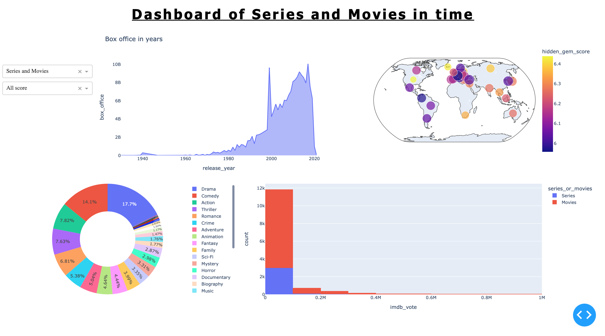

<div id="top"></div>

[![LinkedIn][linkedin-shield]][linkedin-url]
[![Contributors][contributors-shield]][contributors-url]


<!-- PROJECT LOGO -->
<br />
<div align="center">

  <h3 align="center">Series and Movies Py Dashboarding</h3>


</div>

<!-- TABLE OF CONTENTS -->
<details>
  <summary>Table of Contents</summary>
  <ol>
    <li>
      <a href="#about-the-project">About The Project</a>
      <ul>
        <li><a href="#built-with">Built With</a></li>
      </ul>
    </li>
    <li>
      <a href="#getting-started">Getting Started</a>
      <ul>
        <li><a href="#prerequisites">Prerequisites</a></li>
        <li><a href="#installation">Installation</a></li>
      </ul>
    </li>
    <li>
      <a href="#developer_guide">Developer_Guide</a></li>
      <ul>
        <li><a href="#data_cleaning">Data_Cleaning</a></li>
        <li><a href="#dashboard">Dashboard</a></li>
      </ul>
    <li><a href="#roadmap">Roadmap</a></li>
    <li><a href="#contributing">Contributing</a></li>
    <li><a href="#license">License</a></li>
    <li><a href="#contact">Contact</a></li>
    <li><a href="#acknowledgments">Acknowledgments</a></li>
  </ol>
</details>


<!-- ABOUT THE PROJECT -->
## About The Project

This project is a project of our 2 year of engineering study. It take place in september and october and onsite to create a Dashboard with a map and a bar plot. 
The Dataset is present on kaggle : 
www.kaggle.com/ashishgup/netflix-rotten-tomatoes-metacritic-imdb.

This dataset combines data sources from Netflix, Rotten Tomatoes, IMBD, posters, box office information, 
trailers on YouTube, and more using a variety of APIs. 
Note that there is no official Netflix API.

"Hidden Gem Score" is calculated using low review count and high rating. Lower the review count and higher the user rating, higher the hidden gem score.

Use the `README.md` to get started.

<p align="right">(<a href="#top">back to top</a>)</p>

### Built With

This project writed in pyhton 3.8.5 It use a list of library to bootrap it.

* [Pandas.py](https://pandas.pydata.org)
* [Numpy.py](https://numpy.org)
* [Plotly-express.py](https://plotly.com/python/plotly-express/)
* [Dash.py](https://dash.plotly.com)
* [Os.py](https://docs.python.org/fr/3/library/os.html)
* [Kaggle.py](https://github.com/Kaggle/kaggle-api)

<p align="right">(<a href="#top">back to top</a>)</p>


<!-- GETTING STARTED -->
## Getting Started

To get the projet, you need to clone it with the following command 

* Clone git repository
  ```sh
  git clone https://github.com/juju312000/Series_Py_Dashboarding.git
  ```

https://github.com/juju312000/Series_Py_Dashboarding.git 

This repository is storage on github.
To get a local copy, run follow this simple step.

### Prerequisites

You need to install packages to run project.
The simpler way is to run the following code.

* Install prerequisites
  ```sh
  python -m pip install -r requirements.txt
  ```


### Installation

But if you want to install separately you can install one by one like follow.

1. Pandas
  ```sh
  pip install pandas
  ```
2. Numpy
  ```sh
  pip install numpy
  ```
3. Dash
  ```sh
  pip install dash
  ```
4. Plotly
  ```sh
  pip install plotly
  ```
5. Kaggle
  ```sh
  pip install kaggle
  ```

<p align="right">(<a href="#top">back to top</a>)</p>


<!-- Developer_Guide -->
## Developer_Guide

This project is divided in 2 parts :

* Data cleaning 
* Dashboard


### Data Cleaning 

In "data.py" file we first download dataset.
```sh
  kaggle.api.dataset_download_files('ashishgup/netflix-rotten-tomatoes-metacritic-imdb', path='.', unzip=True)
  ```
When it's done, we read the .csv and select columns we want.
We process the data so that it is suitable for conversion or selection.
[clean_dataframe()](data.py) function make it.

In the original dataset in the column "country_availability", countries are present and split by comma.
In the function [split_country_availability](data.py) we create as much columns as countries and we put [True]() or [False]() 
if the country is in or not.

We make the same with genre is the function [split_genre_availability](data.py).

We have so 2 dataframes with a lot of columns. We will pivot them with functions [pivot_country_data](data.py) and [pivot_genre_data](data.py)
That returns a dataframe with (number of original rows) * number of country or genre.

We delete rows which are False in pivot column : "country_availability" or "genre_availability"

Our dataset is ready to be plot.

Example :


### Dashboard

In Dashboard, there are 2 main parts too :

* Frontend
* Backend

Frontend deals with the display.

#### Frontend 


#### Backend

In backend we put what type of figures we want to show and whit what data. 
Each functions show one time of graphics, for exemple :
* [line()](dashboard.py) show a line graph 
* [map_score()](dashboard.py) show a map of the world with score as colors
* [hist()]() show an histogram
* [pie()]() show an pie graph 




<!-- ROADMAP -->
## Roadmap
[example](data/example.png?raw=true)

- [x] Add Changelog
- [x] Add back to top links
- [] Add Additional Templates w/ Examples
- [] Add "components" document to easily copy & paste sections of the readme
- [] Multi-language Support
    - [] Chinese
    - [] Spanish

See the [open issues](https://github.com/othneildrew/Best-README-Template/issues) for a full list of proposed features (and known issues).

<p align="right">(<a href="#top">back to top</a>)</p>


<!-- CONTRIBUTING -->
## Contributing

Contributions are what make the open source community such an amazing place to learn, inspire, and create. Any contributions you make are **greatly appreciated**.

If you have a suggestion that would make this better, please fork the repo and create a pull request. You can also simply open an issue with the tag "enhancement".
Don't forget to give the project a star! Thanks again!

1. Fork the Project
2. Create your Feature Branch (`git checkout -b feature/AmazingFeature`)
3. Commit your Changes (`git commit -m 'Add some AmazingFeature'`)
4. Push to the Branch (`git push origin feature/AmazingFeature`)
5. Open a Pull Request

<p align="right">(<a href="#top">back to top</a>)</p>


<!-- LICENSE -->
## License

Distributed under the MIT License. See `LICENSE.txt` for more information.

<p align="right">(<a href="#top">back to top</a>)</p>


<!-- CONTACT -->
## Contact

Your Name - [@your_twitter](https://twitter.com/your_username) - email@example.com

Project Link: [https://github.com/your_username/repo_name](https://github.com/your_username/repo_name)

<p align="right">(<a href="#top">back to top</a>)</p>


<!-- ACKNOWLEDGMENTS -->
## Acknowledgments

Use this space to list resources you find helpful and would like to give credit to. I've included a few of my favorites to kick things off!

* [Choose an Open Source License](https://choosealicense.com)
* [GitHub Emoji Cheat Sheet](https://www.webpagefx.com/tools/emoji-cheat-sheet)
* [Malven's Flexbox Cheatsheet](https://flexbox.malven.co/)
* [Malven's Grid Cheatsheet](https://grid.malven.co/)
* [Img Shields](https://shields.io)
* [GitHub Pages](https://pages.github.com)
* [Font Awesome](https://fontawesome.com)
* [React Icons](https://react-icons.github.io/react-icons/search)

<p align="right">(<a href="#top">back to top</a>)</p>

<!-- MARKDOWN LINKS & IMAGES -->
<!-- https://www.markdownguide.org/basic-syntax/#reference-style-links -->
[contributors-shield]: https://img.shields.io/github/contributors/juju312000/Series_Py_Dashboarding.svg?style=for-the-badge
[contributors-url]: https://github.com/juju312000/Series_Py_Dashboarding/graphs/contributors
[forks-shield]: https://img.shields.io/github/forks/othneildrew/Best-README-Template.svg?style=for-the-badge
[forks-url]: https://github.com/othneildrew/Best-README-Template/network/members
[stars-shield]: https://img.shields.io/github/stars/othneildrew/Best-README-Template.svg?style=for-the-badge
[stars-url]: https://github.com/othneildrew/Best-README-Template/stargazers
[issues-shield]: https://img.shields.io/github/issues/othneildrew/Best-README-Template.svg?style=for-the-badge
[issues-url]: https://github.com/othneildrew/Best-README-Template/issues
[license-shield]: https://img.shields.io/github/license/othneildrew/Best-README-Template.svg?style=for-the-badge
[license-url]: https://github.com/othneildrew/Best-README-Template/blob/master/LICENSE.txt
[linkedin-shield]: https://img.shields.io/badge/-LinkedIn-black.svg?style=for-the-badge&logo=linkedin&colorB=555
[linkedin-url]: https://linkedin.com/in/jmarchadier
[exemple]: data/example.png
