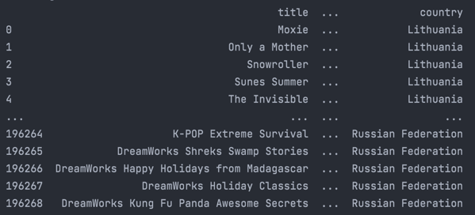
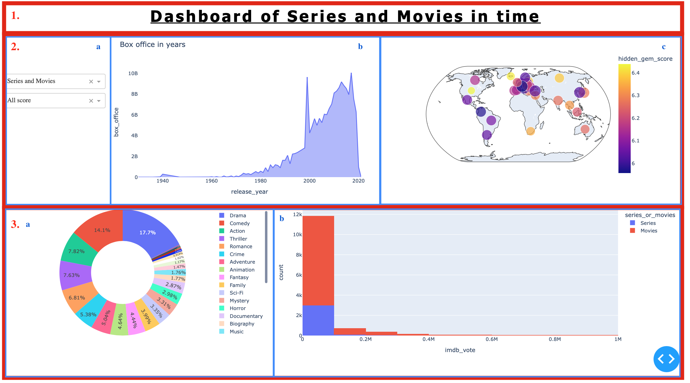

<div id="top"></div>

[![LinkedIn_juju][linkedin-shield]](https://linkedin.com/in/jmarchadier)
[![Contributors][contributors-shield]](https://github.com/juju312000/Series_Py_Dashboarding/graphs/contributors)


<!-- PROJECT LOGO -->
<br />
<div align="center">

  <h3 align="center">Series and Movies Py Dashboarding</h3>


</div>

<!-- TABLE OF CONTENTS -->
<details>
  <summary>Table of Contents</summary>
  <ol>
    <li>
      <a href="#about-the-project">About The Project</a>
      <ul>
        <li><a href="#built-with">Built With</a></li>
      </ul>
    </li>
    <li>
      <a href="#getting-started">Getting Started</a>
      <ul>
        <li><a href="#prerequisites">Prerequisites</a></li>
        <li><a href="#installation">Installation</a></li>
        <li><a href="#run project">Run project</a></li>
      </ul>
    </li>
    <li>
      <a href="#developer_guide">Developer_Guide</a></li>
      <ul>
        <li><a href="#data_cleaning">Data_Cleaning</a></li>
        <li>
          <a href="#dashboard">Dashboard</a>
            <ul>
              <li><a href="#frontend">Frontend</a></li>
              <li><a href="#backend">Backend</a></li>
            </ul>
        </li>
      </ul>
    <li><a href="#contact">Contact</a></li>
  </ol>
</details>


<!-- ABOUT THE PROJECT -->
## About The Project

This is is a project of our second year of engineering study. 
It took place in september and october.
The goal is to create a interactive Dashboard with a map and a histogram. 
The Dataset is present on kaggle : 
www.kaggle.com/ashishgup/netflix-rotten-tomatoes-metacritic-imdb.

This dataset combines data sources from Netflix, Rotten Tomatoes, IMBD, posters, box office information, 
trailers on YouTube, and more using a variety of APIs. 
Note that there is no official Netflix API.

"Hidden Gem Score" is calculated using low review count and high rating. Lower the review count and higher the user rating, higher the hidden gem score.

Use the `README.md` to get started.

<p align="right">(<a href="#top">back to top</a>)</p>

### Built With

This project written in python 3.8.5 It uses a list of library to bootstrap it.

* [Pandas.py](https://pandas.pydata.org)
* [Numpy.py](https://numpy.org)
* [Plotly-express.py](https://plotly.com/python/plotly-express/)
* [Dash.py](https://dash.plotly.com)
* [Os.py](https://docs.python.org/fr/3/library/os.html)
* [Kaggle.py](https://github.com/Kaggle/kaggle-api)

<p align="right">(<a href="#top">back to top</a>)</p>


<!-- GETTING STARTED -->
## Getting Started

To get the project, you need to clone it with the following command 

* Clone git repository
  ```sh
  git clone https://github.com/juju312000/Series_Py_Dashboarding.git
  ```

https://github.com/juju312000/Series_Py_Dashboarding.git 

This repository is storage on github.
To get a local copy, run follow this simple step.

### Prerequisites

You need to install packages to run project.
The simpler way is to run the following code.

* Install prerequisites
  ```sh
  python -m pip install -r requirements.txt
  ```


### Installation

But if you want to install separately you can install one by one like follow.

1. Pandas
  ```sh
  pip install pandas
  ```
2. Numpy
  ```sh
  pip install numpy
  ```
3. Dash
  ```sh
  pip install dash
  ```
4. Plotly
  ```sh
  pip install plotly
  ```
5. Kaggle
  ```sh
  pip install kaggle
  ```


### Run project
If no error appear, you can run the project by execute the command follow : 
 ```sh
  python main.py
  ```

<p align="right">(<a href="#top">back to top</a>)</p>


<!-- Developer_Guide -->
## Developer_Guide

This project is divided in 2 parts :

* Data cleaning 
* Dashboard


### Data Cleaning 

In "data.py" file we first download dataset.
```sh
  kaggle.api.dataset_download_files('ashishgup/netflix-rotten-tomatoes-metacritic-imdb', path='.', unzip=True)
  ```
When it's done, we read the .csv and select columns we want.
We process the data so that it is suitable for conversion or selection.
[clean_dataframe()](data.py) function make it.

In the original dataset in the column "country_availability", countries are present and split by comma.
In the function [split_country_availability](data.py) we create as much columns as countries and we put [True]() or [False]() 
if the country is in or not.

We make the same with genre is the function [split_genre_availability](data.py).

We have so 2 dataframes with a lot of columns. We will pivot them with functions [pivot_country_data](data.py) and [pivot_genre_data](data.py)
That returns a dataframe with (number of original rows) * number of country or genre.

We delete rows which are False in pivot column : "country_availability" or "genre_availability"

Our dataset is ready to be plot.

Example :




### Dashboard

In Dashboard, there are 2 main parts too :

* Frontend
* Backend

Frontend deals with the display.
Backend is all aspects that users don't see but participate to create the dashboard.

#### Frontend 

Frontend print what we see and that start by create layout to divide the display.
We divide the screen in 3 rows of 10, 45 and 45 % of the maximum height. 
In each row we divide again if we need it.

We use HTML code to make it :
```sh
  html.Div(children=[ .... ])
  ```
In divided screen we decide what type of information we want to show : graphics, labels, images, filters ...

In the dashboard we a Title center in the top.
```sh
  html.H1(
                id='title1',
                children='Series In Time',
                style={'textAlign': 'center', 'text-decoration': 'underline', 'letter-spacing': '5px',
                       'font-family': 'Tahoma, sans-serif',
                       'font-size': '3vw'}
            ),
  ```
In the middle row we have 2 [dropdowns](dashboard.py) and 1 [checklist](dashboard.py) on the left, 
a [graph line](dashboard.py) on the center, and a [map](dashboard.py) on the right.

```sh
  dcc.Dropdown(
             id='series_or_movies_dropdown',
             options=[ { ... }],
             value='Series and Movies'
             ),
  ....
  ```

On the last row we have a [pie](dashboard.py) on the left and a [histogram](dashboard.py) on the right.

```sh
  dcc.Graph(
    id="map",
    figure=fig[0]
  )
  ....
  ```


So we obtain a screen split in 6 displays like this :


#### Backend

In backend we work on what type of figures we want to build and with what data. 
Each functions show one time of graphics, for example :
* [line()](dashboard.py) show a line graph 
* [map_score()](dashboard.py) show a map of the world with score as colors
* [hist()](dashboard.py) show an histogram
* [pie()](dashboard.py) show an pie graph

Callback function allow dashboard to be interactive. 
We place in Input all filter and also possible cross filtering.
In Output there are all features who need to be modify : graphs, title...

Thanks to functions [movies_or_series_f](), [best_score_f](), [watch_time_f](), [crossfilter]() 
we can return filtering data sets.

After we rebuild all graphs with new data. That can take some time if modify a lot of data.

```sh
  map_score(df[1]), line(df[0]), hist(df[0]), pie(df[2])
  ```

<!-- ANALYSIS REPORT -->
## Analysis Report

We can show several things according to the user's desire thanks to our filters.
For example :
* Thanks to the graph representing the evolution of the world box office we can see that the curve follows an increasing trend for the movies which isn't the case for the series.

* Whatever the filter applied, we can see that the 2 dominant genres are Drama and Comedy (for both series and movies).

* We want to observe in which region are the best productions. In order to have our information we look at the map with the best 30 score filter.
  We can see that in general, North America and Europe concentrate the most high rated movies.
  The above examples show only a small part of what can be represented with this type of dashboard. It's up to you to draw the one you like.

Warning:
Applying too many filters can cause errors due to lack of data.

Translated with www.DeepL.com/Translator (free version)


<!-- CONTACT -->
## Contact

MARCHADIER Julien - julien.marchadier@edu.esiee.fr

Rebuffey Valentin - valentin.rebuffey@edu.esiee.fr

Project Link: [https://github.com/juju312000/Series_Py_Dashboarding](https://github.com/juju312000/Series_Py_Dashboarding )

<!-- MARKDOWN LINKS & IMAGES -->
[contributors-shield]: https://img.shields.io/github/contributors/juju312000/Series_Py_Dashboarding.svg?style=for-the-badge
[linkedin-shield]: https://img.shields.io/badge/-LinkedIn-black.svg?style=for-the-badge&logo=linkedin&colorB=555


